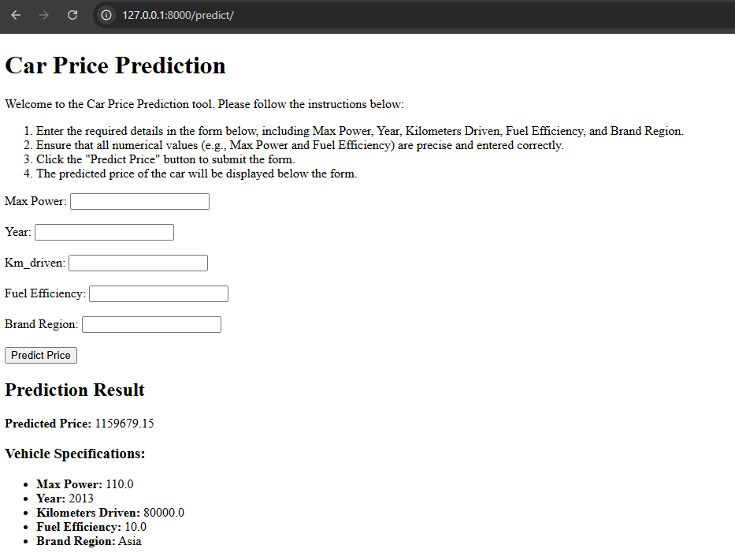

# Car Price Prediction 
### By Patsakorn st124876 in Machine Learning 2025 Jan Semester
A machine learning-based web application that predicts the price of cars based on user-provided specifications. This project uses supervised learning algorithms and provides a web interface for user interaction.
## Project Description
This project predicts car prices using a machine learning model trained on historical data. Users can input car details, such as maximum power, year of manufacture, fuel efficiency, and brand region, to get an estimated price.
The project includes:
- A trained machine learning model.
- A FastAPI-based backend.
- A simple web interface for user interaction.
## Features
- Predict car prices based on various input features.
- Provides a user-friendly web interface to input data and view predictions.
- Demonstrates the usage of preprocessing techniques (e.g., scaling, encoding).
- lmplements modern machine learning practices, such as feature transformation and data standardization.
## Technologies Used
- Programming Language: Python
- Machine Learning Libraries: Scikit-learn, NumPy, Pandas
- Web Framework: FastAPI
- Frontend: HTML (Jinja2 templates)
- Deployment: GitHub
## File Structure
- `main.py`: Backend implementation using FastAPI.
- `templates/`: HTML templates for the web interface.
- `model/`: Pre-trained machine learning model files.
- `preprocess/`: Preprocessing files (e.g., scalers, encoders).
- `A1_Car_Price_Prediction_V2___.ipynb`: Jupyter notebook for model training and analysis.
- `Cars.csv`: Dataset used for training the model.
## How to run
### Prerequisites
- Python 3.7 or above installed on your system.
### Set up steps
1. Clone the repository:
```
git clone <repository-url>
cd Car-Price-Prediction
```
2. Docker compose up 
```
docker compose up

```
3. Attach docker via visualstudio code
4. Run website using FastAPI's uvicorn
```
uvicorn main:app --reload
```
## How to use
1. Go to the web interface.
2. Enter the car details in the input form.
3. Click the "Predict Price" button.
4. View the predicted price below the form.
## `NOTE:`
- `A1_Car_Price_Prediction_V2___.ipynb` is in `app` folder
- The rest of the model components are also in the `app` folder


